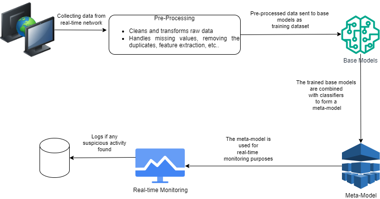

# Network Intrusion Detection System (NIDS) using Machine Learning

This project aims to detect malicious activities in network traffic by using advanced machine learning techniques. It implements a real-time Network Intrusion Detection System (NIDS) with a stacking ensemble model and a user-friendly web interface for live monitoring.

---

## Abstract

In the current digital landscape, cyber threats are increasingly sophisticated and frequent. Traditional security mechanisms like firewalls and antivirus tools are insufficient against modern attacks. This project proposes a Network Intrusion Detection System that integrates a machine learning-based stacking ensemble with a real-time monitoring interface. The solution combines base models (XGBoost, LightGBM, CatBoost, SVM, MLP, ANN, GRU) under a meta-classifier (XGBoost) to detect and respond to network anomalies with high accuracy.

---

## Key Features

* Stacking ensemble classifier for enhanced accuracy.
* Real-time intrusion monitoring through a web interface.
* Visual analytics for traffic and prediction results.
* Interactive charts using Plotly.

---

## Objectives

* Design and implement a ML-based NIDS.
* Detect anomalies from structured network data.
* Improve classification using ensemble techniques.
* Visualize detection results in real time.

---

## Dataset

[NIDS_Dataset](https://www.kaggle.com/datasets/tharunbharathi03/network-intrusion-detection-system)

* Contains normal and malicious traffic labeled by type.
* Features include: `duration`, `protocol_type`, `service`, `flag`, `src_bytes`, `dst_bytes`, `error rates`, etc.
* Cleaned, encoded, and balanced using SMOTE.

---

## System Architecture

1. **Real Network Traffic**: Captured via sniffers/loggers.
2. **Preprocessing**: Outlier removal, imputation, encoding.
3. **Model Training**: ML models are trained on preprocessed data.
4. **Meta-Model Creation**: A stacking classifier combines predictions from base models.
5. **Real-Time Monitoring**: Incoming traffic is classified live.
6. Feature Engineering
7. Label Encoding and Standardization
8. Base Models → Meta-Model → Prediction → Visualization

---

## Models Implemented

| Model       | Accuracy   |
| ----------- | ---------- |
| XGBoost     | 82.53%     |
| LightGBM    | 83.80%     |
| CatBoost    | 83.86%     |
| SVM         | 77.59%     |
| MLP         | 71.27%     |
| ANN         | 67.35%     |
| GRU         | 78.07%     |
| **Stacked** | **83.92%** |

**Best Model:** Stacked Ensemble (Meta-model: XGBoost)

---

## Performance Metrics

* **Precision**: 0.84 (Attack)
* **Recall**: 1.00 (Attack)
* **F1-Score**: 0.91 (Attack)
* **Cross-validated Accuracy**: 84.43%
* **False Positives**: 267 (out of 1660 samples)

---

## Technologies Used

* **Languages**: Python, HTML, JavaScript
* **Libraries**: Scikit-learn, XGBoost, LightGBM, CatBoost, Keras, Pandas, NumPy, Matplotlib, Seaborn
* **Tools**: Flask (for API), Plotly (for charting), SMOTE (for class imbalance)

---

## Web Interface

* Flask-based API endpoint (`/predict`)
* Plotly.js visualization for prediction over time
* Generates test data and live plots results every 5 seconds

---

## Results

### Metrics Table

| Class | Precision | Recall | F1-Score | Support |
| ----- | --------- | ------ | -------- | ------- |
| 0     | 1.00      | 0.00   | 0.01     | 268     |
| 1     | 0.84      | 1.00   | 0.91     | 1392    |

---

## Future Work

* Improve precision by tuning ensemble parameters.
* Integrate threat intelligence feeds.
* Use deep learning + unsupervised techniques.
* Deploy in scalable cloud infrastructure.

---
